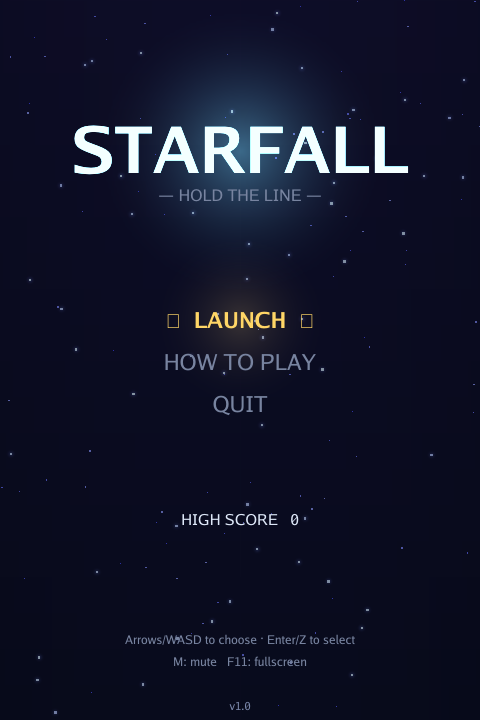
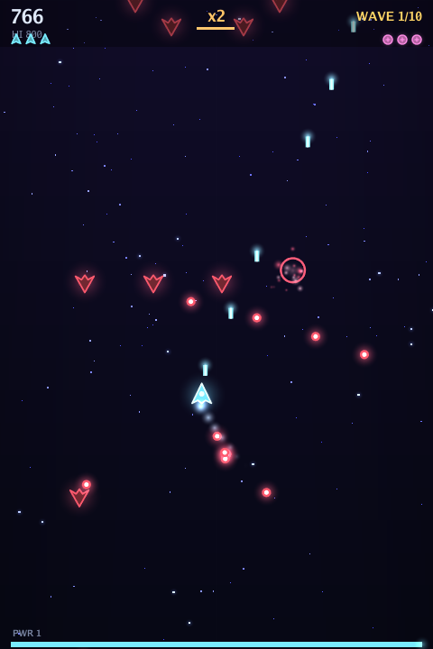
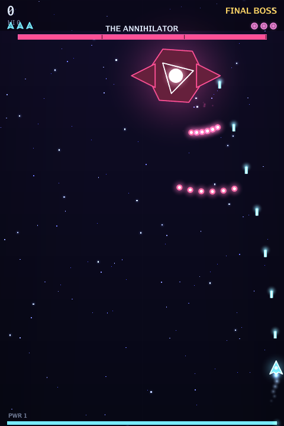

# STARFALL

**A neon vertical-scrolling arcade shoot-'em-up.** Hold the line against ten
waves of descending raiders, survive the Warden mini-boss, and tear down the
Annihilator. A full run takes roughly **twenty minutes** — one tight, complete
arcade loop from title screen to victory.

Built in Go with [Ebitengine](https://ebitengine.org). Ships as a **single
self-contained Windows `.exe`** — no installer, no runtime, no external asset
files. Every sprite, sound, and the music are generated procedurally at startup.

<p align="center">
  
  
  
</p>

## Play it

Download / grab **`dist/STARFALL.exe`** and double-click it on Windows 10/11
(64-bit). That's the whole install.

> The first launch creates a tiny save file at
> `%AppData%\Starfall\save.json` to remember your high score and mute setting.

## Controls

| Action | Keys |
| --- | --- |
| Move | Arrow keys or **WASD** |
| Fire | **Z** / **Space** (hold) |
| Bomb | **X** — clears all enemy bullets and deals heavy damage |
| Focus | **Shift** — move slowly and precisely; reveals your true hitbox |
| Pause | **Esc** / **P** |
| Mute | **M** |
| Fullscreen | **F11** |

A gamepad works too (left stick / d-pad to move, A to fire, B/X to bomb).

## The game loop

1. **Title** → choose *Launch*.
2. **Ten escalating waves** of six enemy types — grunts, weavers, dive-bombers,
   armored cruisers, bombers, and proximity mines.
3. A **mini-boss** (the *Warden*) at the halfway mark.
4. The **final boss** (the *Annihilator*) — three phases, each with new bullet
   patterns: aimed volleys, rotating spirals, bullet walls with a gap to thread,
   radial rings, and summoned reinforcements.
5. **Victory** or **Game Over** → see your stats and high score → play again.

### Tips

- **Chain your kills.** Destroying enemies without taking a hit builds a score
  multiplier up to **x8**. Getting hit resets it.
- **Grab power-ups** dropped by tougher foes: `P` upgrades your weapon (up to six
  levels of spread fire), `S` restores shield, `B` is an extra bomb, `$` is pure
  points.
- **Save bombs for trouble.** A bomb wipes the screen of bullets and chunks a
  boss's health — clutch when a pattern boxes you in.
- **Focus mode** (Shift) is your friend in dense bullet patterns: slower, surgical
  movement, and it shows the tiny hitbox you actually need to keep safe.

## Build from source

Requires the Go toolchain (1.24+). No C compiler is needed for the Windows build.

```sh
./build.sh          # cross-compiles dist/STARFALL.exe from any OS
```

Or directly:

```sh
GOOS=windows GOARCH=amd64 CGO_ENABLED=0 \
  go build -trimpath -ldflags "-s -w -H windowsgui" -o dist/STARFALL.exe .
```

To run/develop natively on your own machine (Linux/macOS/Windows):

```sh
go run .
```

> On Linux you'll need the usual Ebitengine dev packages (X11/OpenGL/ALSA headers)
> for a native build; the Windows cross-build above needs none of that.

## Tested

The game logic is exercised by a headless simulation suite (`internal/game`):

- `TestFullCampaignCompletes` plays the **entire campaign end-to-end** and asserts
  it reaches victory without panicking.
- `TestBossKillTimes` measures boss fight pacing.
- `TestPlayerCanDie`, `TestEarlyEnemiesDie`, and math/collision unit tests guard
  the core mechanics.

```sh
go test ./...
```

## How it's built

- **Engine:** Ebitengine (pure-Go, cross-compiles to Windows with no cgo).
- **Graphics:** everything is drawn from vector primitives — neon polygons with
  additive glow sprites, a parallax starfield, particle explosions, screen shake,
  and hit flashes. No image files.
- **Audio:** all sound effects and the looping chiptune soundtrack are synthesized
  from scratch into PCM at startup. No audio files.
- **Fonts:** the embedded Go fonts (`golang.org/x/image/font/gofont`).

```
main.go                 # entry point + window setup
internal/game/
  game.go               # top-level state machine (menus, transitions, HUD overlay)
  play.go               # gameplay session: collisions, scoring, combos, effects
  player.go enemy.go boss.go bullet.go powerup.go   # entities
  waves.go              # the campaign script + director
  particle.go starfield.go shapes.go assets.go      # rendering systems
  audio.go              # procedural sound + music synthesis
  hud.go input.go save.go mathx.go constants.go
```

---

*Made as a self-contained arcade game. Good luck out there, pilot.*
